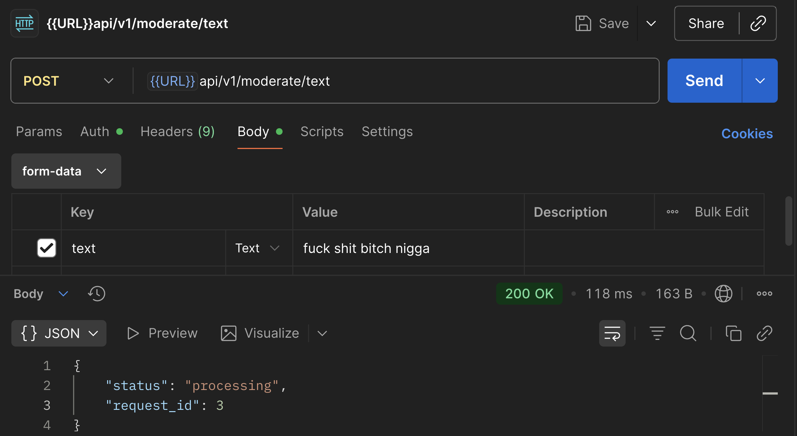
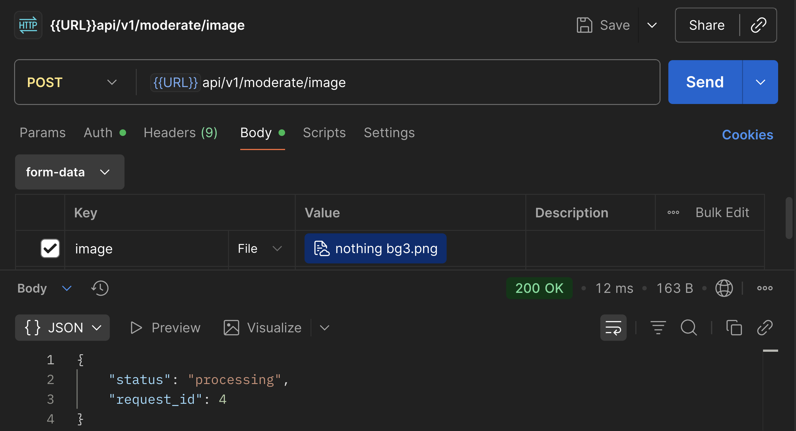
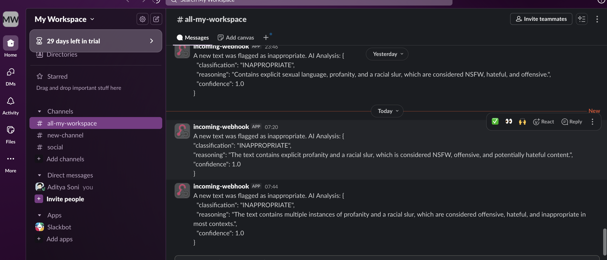
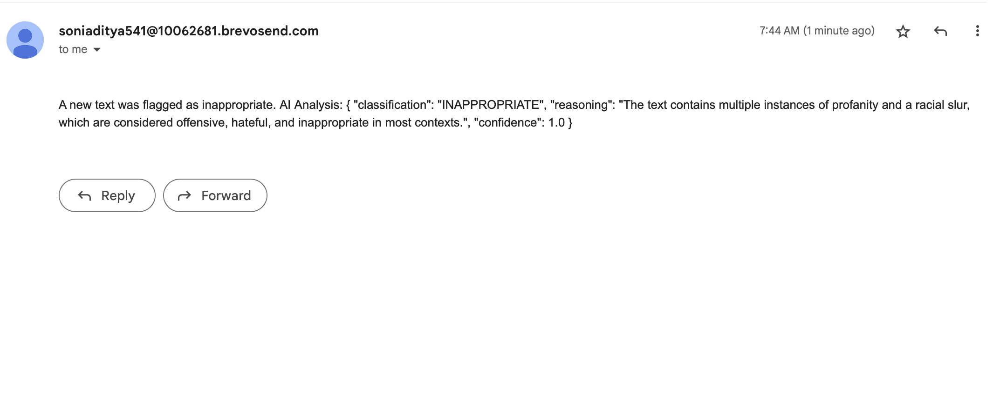

# Content Moderation Service (FastAPI + PostgreSQL)

  

A modern AI-powered **content moderation backend** built with **FastAPI** and **PostgreSQL**, capable of analyzing user-submitted **text or image content** for inappropriate material.

It stores moderation results, sends **alerts via email/Slack**, and provides analytics endpoints for future use.

  

---

  

## 🚀 Features

  

- 🧩 **Text Moderation** — Uses a free LLM API (Perplexity/Sonar Pro or compatible) to detect inappropriate or NSFW content.

- 🖼️ **Image Moderation** — Detects explicit or unsafe images using AI APIs (extendable).

- 📨 **Email Alerts** — Sends alert notifications through **Brevo (Sendinblue)** when flagged content is detected.

- 💬 **Slack Notifications** — Optional real-time alerts to a Slack channel.

- 🧾 **Database Storage** — Logs moderation results, user info, and notifications in PostgreSQL.

- 🔐 **JWT Authentication** — Only logged-in users can submit moderation requests.

- 📊 **Analytics Ready** — Stores detailed moderation logs for insights and dashboards.

- ⚡ **Async Background Tasks** — Handles moderation and notifications asynchronously using FastAPI BackgroundTasks for improved performance and responsiveness.

  

---

  

## 🏗️ Tech Stack

  

| Layer | Technology |

|-------|-------------|

| Backend | [FastAPI] |

| Database | [PostgreSQL] |

| ORM | [SQLAlchemy]|

| Schema Validation | [Pydantic]|

| Authentication | JWT (JSON Web Tokens) |

| Notifications | Brevo API & Slack Webhooks |

| AI Model | Sonar-Pro (Perplexity API) |

  

---

  

## 🗂️ Setup Locally

  

1.  **Clone the repository**

git clone <https://github.com/Adityasoni8898/Content-Moderator-API.git>  

cd Content-Moderator-API/

   

2.  **Install dependencies**

pip install -r requirement.txt

   

3.  **Create a .env file and set the environment variable**

DATABASE_HOSTNAME=host  

DATABASE_PORT=port  

DATABASE_NAME=postgres 

DATABASE_USERNAME=postgres 

DATABASE_PASSWORD=your_password 

SECRET_KEY=your_secret_key 

ALGORITHM=HS256 

ACCESS_TOKEN_EXPIRY_MINUTES=your_token_expiry_time 

PERPLEXITY_API_KEY=your_api_key 

SLACK_WEBHOOK_URL=your_slack_webhook_url 

BREVO_API_KEY=your_brevo_api_key 

BREVO_SENDER_EMAIL=your_sender_email 

  
 
4.  **Run the application**

uvicorn app.main:app --reload --port 8000

---

  

## 🐳 Setup Using Docker (Locally)

  

1.  **Clone the repository**

git clone <https://github.com/Adityasoni8898/Content-Moderator-API.git>

cd Content-Moderator-API/

   

2.  **Create a .env file and set the environment variable**

DATABASE_HOSTNAME=host  

DATABASE_PORT=port  

DATABASE_NAME=postgres 

DATABASE_USERNAME=postgres 

DATABASE_PASSWORD=your_password 

SECRET_KEY=your_secret_key 

ALGORITHM=HS256 

ACCESS_TOKEN_EXPIRY_MINUTES=your_token_expiry_time 

PERPLEXITY_API_KEY=your_api_key 

SLACK_WEBHOOK_URL=your_slack_webhook_url 

BREVO_API_KEY=your_brevo_api_key 

BREVO_SENDER_EMAIL=your_sender_email  

  

3.  **Build and Run the Docker Container**

docker-compose up --build -d

  

4.  **Access the API**

http://localhost:8000/api/v1

   

## 🗂️ Project Structure

  

.env # Environment variables 

docker-compose # Docker setup file  

Dockerfile # Docker file  

app/ 

│ 

├── main.py # FastAPI entry point 

├── database.py # Database setup and session management 

├── models.py # SQLAlchemy models 

├── schemas.py # Pydantic schemas 

├── routers/  

│ ├── auth.py # User login and signup 

│ ├── moderation.py # Text & Image moderation 

│ └── analytics.py # Analytics and reporting 

├── utils/  

│ ├── alerts.py # handle sending inappropriate content alert 

│ ├── oauth2.py # JWT token and authentication logic 

│ └── security.py # Password hashing and verifying logic  

├── services/ 

│ ├── moderate_services.py # handle text & image moderation  

  ---

## 📡 API Endpoints
Below is the list of all available API routes, their purpose, and how to use them.

  

**🏠 Root Endpoint **

GET -> `/api` 

  

Description: Check if the API server is running. 

  

Example Response:

{"message": "Welcome to the Content Moderation API!"} 
 

**🔐 Auth Routes **

1. Signup -> POST `/api/v1/signup`

	Description: Register a new user account.
	
	Request Body (JSON): {
	"email": "user@example.com",
		"password": "securepassword123"
	 } 

2. Login -> POST `/api/v1/login`  

	Description: Authenticate an existing user and receive a JWT token. 

	Form Data:
	username=user@example.com
password=securepassword123 
 

**🧩 Moderation Routes**

1. Text Moderation
	
	POST -> `/api/v1/text`

	Description: Analyze and classify a piece of text (e.g., detect NSFW or harmful content).

	Headers: Authorization: Bearer <JWT_TOKEN>

	Form Data:
	text=This is the text content to moderate.

2. Image Moderation -> POST `/api/v1/image`

	Description: Upload and moderate an image file.

	Headers: Authorization: Bearer <JWT_TOKEN>

	Form Data:
image=file input
 

**📊 Analytics Routes**

1. Get User Analytics Summary -> GET `/api/v1/summary`

	Description: Retrieve moderation analytics for a specific user.

	Query Parameter: user=user@example.com

	Headers: Authorization: Bearer <JWT_TOKEN>

	Response Example:
	{
	"total_requests":  4,
	"total_results":  4,
	"safe_count":  2,
	"inappropriate_count":  2
	}

**You can explore all endpoints interactively via the built-in Swagger UI:**

`http://localhost:8000/docs`

   
  ---

### Alerts

  

When a piece of content is flagged as inappropriate, the system performs the following actions automatically:

1. 📧 Email Alert — Sends a notification via Brevo (Sendinblue) to the configured recipient.

2. 💬 Slack Notification (optional) — Sends a message to a Slack channel via webhook.

3. 🧾 Database Log — Creates an entry in the notification_logs table for tracking.

---
### Output Images

